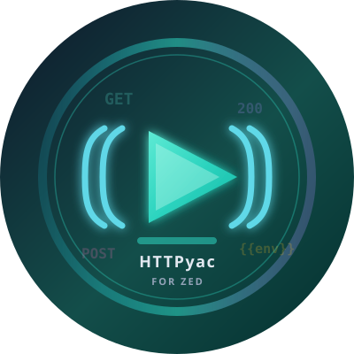

<div align="center">
  
  <h1>HTTPyac Client for Zed</h1>
  <p>
    Edit and run <code>.http</code> / <code>.rest</code> files in
    <a href="https://zed.dev">Zed</a>.<br/>
    <strong>Execution uses the official
    <a href="https://httpyac.github.io/">httpyac</a> CLI</strong>
    (variables, env, and scripts are interpreted by httpyac).
  </p>
</div>

---

## What this is

| Layer | Role | Source |
|-------|------|--------|
| Zed extension (WASM) | Starts the language server | This repo |
| **httpyac-lsp** | Completions, symbols, etc. | **Custom** (not an official httpyac LSP) |
| **httpyac-run** | ▶ menu entry for send / env switch | **Custom** |
| **httpyac** | Real request execution, env, scripts | **Official CLI** |

Send path:

```text
▶ Send → httpyac-run → httpyac send --line N [--env name]
```

### Autocomplete: two layers

| What you type | Who completes it |
|---------------|------------------|
| `Host`, `{{base_url}}`, HTTP-specific entries | **httpyac-lsp** (this extension) |
| 11 个 httpyac 全局变量及 `request.` / `response.` 类型提示 | **child vtsls** + `lsp/httpyac-models` official snapshot |
| JS / Node (`crypto`, `JSON`, …) in scripts | **child vtsls** |
| Script `request.` / `client.` | **child vtsls** inside script islands |
| **Full** Node/`crypto` in **`.js`** (Zed-managed vtsls) | Open real modules — [docs/VTSLS-SCRIPTS.md](docs/VTSLS-SCRIPTS.md) |
| **Full** TS IntelliSense **inside** `.http` `{{ }}` scripts | Child **vtsls** via httpyac-lsp — install `@vtsls/language-server`, set `httpyac.vtsls_command` ([docs/VTSLS-MULTI-LSP-REVIEW.md](docs/VTSLS-MULTI-LSP-REVIEW.md)) |
| **Official httpyac globals** + child **vtsls** (Node/JS/TS and user modules) | [docs/SCRIPT-EXT.md](docs/SCRIPT-EXT.md) |
| **Review / crash-hardening notes** | [docs/REVIEW-SCRIPT-COMPLETIONS.md](docs/REVIEW-SCRIPT-COMPLETIONS.md) |
| JSON body highlighting | Tree-sitter injections (bodies only; no JS inject in scripts) |
| Running the script | **httpyac CLI** |

See [docs/ARCHITECTURE.md](docs/ARCHITECTURE.md).

---

## Requirements

| Tool | Purpose | Install |
|------|---------|---------|
| **httpyac** | Run requests | `npm install -g httpyac` |
| **Node.js** | Runs httpyac | [nodejs.org](https://nodejs.org/) |
| **Rust** + `wasm32-wasip2` | Build this extension (WASM **component**) | [rustup](https://rustup.rs/) |
| **Zed** | Editor | [zed.dev](https://zed.dev/) |

```bash
npm install -g httpyac && httpyac --version
rustup target add wasm32-wasip2
```

---

## Install (macOS / Linux)

```bash
cd httpyacclient
./install_to_zed.sh
```

Then:

1. Ensure `export PATH="$HOME/.local/bin:$PATH"`
2. **Fully quit Zed** (Cmd+Q on macOS — not just close the window) and reopen
3. Open `examples/basic.http` and try Send

More detail: [docs/SETUP.md](docs/SETUP.md).

### Platform paths

| | macOS | Linux |
|-|-------|-------|
| Extension | `~/Library/Application Support/Zed/extensions/installed/httpyacclient` | `~/.config/zed/extensions/installed/httpyacclient` |
| Settings | **`~/.config/zed/settings.json`** | Same |
| Binaries | `~/.local/bin/httpyac-lsp`, `httpyac-run` | Same |

### Install script flags

```bash
SKIP_ZED_SETTINGS=1 ./install_to_zed.sh    # never touch settings.json
FORCE_ZED_SETTINGS=1 ./install_to_zed.sh   # force-merge settings (// comments lost; backup created)
NO_COLOR=1 ./install_to_zed.sh             # disable ANSI colors
```

---

## Send & environments

Gutter ▶ menu (`tasks.json` → **httpyac-run**):

| Menu item | Behavior |
|-----------|----------|
| **▶ Send Request** | Send using current `activeEnv` |
| **🌐 Switch Environment** | Change `activeEnv` only — **no request**, no extra files |
| **🌐 Send with Environment…** | Pick env, then send |
| **⊕ Send in New Tab** | Same as Send in a new terminal tab |

### Environment file

`http-client.env.json` (next to the `.http` file or any parent):

```json
{
  "activeEnv": "dev",
  "dev": {
    "base_url": "https://httpbin.org",
    "user": "zhangsan"
  },
  "prod": {
    "base_url": "https://httpbin.org",
    "user": "lisi"
  }
}
```

```http
### Use env vars
GET {{base_url}}/get
```

Secrets: `http-client.private.env.json` (do not commit).

**Switch Environment** only updates `activeEnv` inside the existing `http-client.env.json`.

### CLI

```bash
httpyac-run api.http 12
httpyac-run api.http --switch-env
httpyac-run api.http 12 --env prod
httpyac-run api.http 12 --pick-env
```

---

## `settings.json`

Optional. Works without it if PATH is correct.

```json
{
  "httpyac": {
    "command": "/absolute/path/to/httpyac",
    "lsp_command": "/absolute/path/to/httpyac-lsp",
    "vtsls_command": "/absolute/path/to/vtsls",
    "default_env": "dev"
  },
  "lsp": {
    "httpyac-lsp": {
      "binary": {
        "path": "/absolute/path/to/httpyac-lsp",
        "arguments": []
      },
      "settings": {
        "vtslsCommand": "/absolute/path/to/vtsls"
      }
    }
  },
  "languages": {
    "HTTP": {
      "language_servers": ["httpyac-lsp"],
      "completions": {
        "words": "fallback",
        "words_min_length": 3
      }
    }
  }
}
```

Install vtsls once (script-region full TS):

```bash
npm install -g @vtsls/language-server
which vtsls && vtsls --version
```

| Key | Meaning |
|-----|---------|
| `httpyac.command` | Path to httpyac CLI |
| `httpyac.lsp_command` | Path to httpyac-lsp |
| `httpyac.vtsls_command` | Path to `vtsls` binary (required for script and official httpyac model completion) |
| `httpyac.default_env` | Docs/default name; runtime uses JSON `activeEnv` |
| `lsp.httpyac-lsp.binary.path` | Binary Zed uses to start the LSP |
| `lsp.httpyac-lsp.settings.vtslsCommand` | Same as `httpyac.vtsls_command` |
| `languages.HTTP.language_servers` | Must include **only** `httpyac-lsp` (do **not** add Zed’s `vtsls` on HTTP) |
| `languages.HTTP.completions.words` | `fallback` = word list only if LSP has no results (avoids “Hello” hiding **Host**) |
| `languages.HTTP.completions.words_min_length` | Min chars for word completions (use ≥3) |

Process env: `HTTPYAC_BIN` = httpyac CLI; `HTTPYAC_VTSLS_COMMAND` = vtsls binary (set by extension / install).

> If settings contain `//` comments, the install script **does not auto-write** (preserves comments).

---

## Examples

| File | Description |
|------|-------------|
| `examples/basic.http` | Basic methods |
| `examples/variables.http` | `@var` / `{{var}}` |
| `examples/environments.http` | Environment variables |
| `examples/http-client.env.json` | `dev` / `prod` / `staging` |
| `examples/response-capture.http` | Response scripts (httpyac) |
| `examples/edge-cases.http` | Edge cases |

---

## Development

```bash
cd lsp && cargo test && cargo build --release && cd ..
cargo build --release --target wasm32-wasip2
./install_to_zed.sh
```

Docs index: [docs/README.md](docs/README.md)

---

## Troubleshooting

| Symptom | Fix |
|---------|-----|
| No ▶ buttons | Fully restart Zed; check extension is under `installed/` |
| `httpyac-run: not found` | Add `~/.local/bin` to PATH; restart Zed |
| `base_url is not defined` | Must use **httpyac-run** (passes `--env`); check `activeEnv` and env file |
| No “Switch Environment” | Reinstall / refresh `tasks.json`; restart Zed |
| Only old Send / New Tab | Stale tasks; re-run `./install_to_zed.sh` |

---

## License

MIT — see [LICENSE](LICENSE).

## Documentation

- [SETUP](docs/SETUP.md)
- [ARCHITECTURE](docs/ARCHITECTURE.md)
- [CONTRIBUTING](docs/CONTRIBUTING.md)
- [Changelog](CHANGELOG.md)
